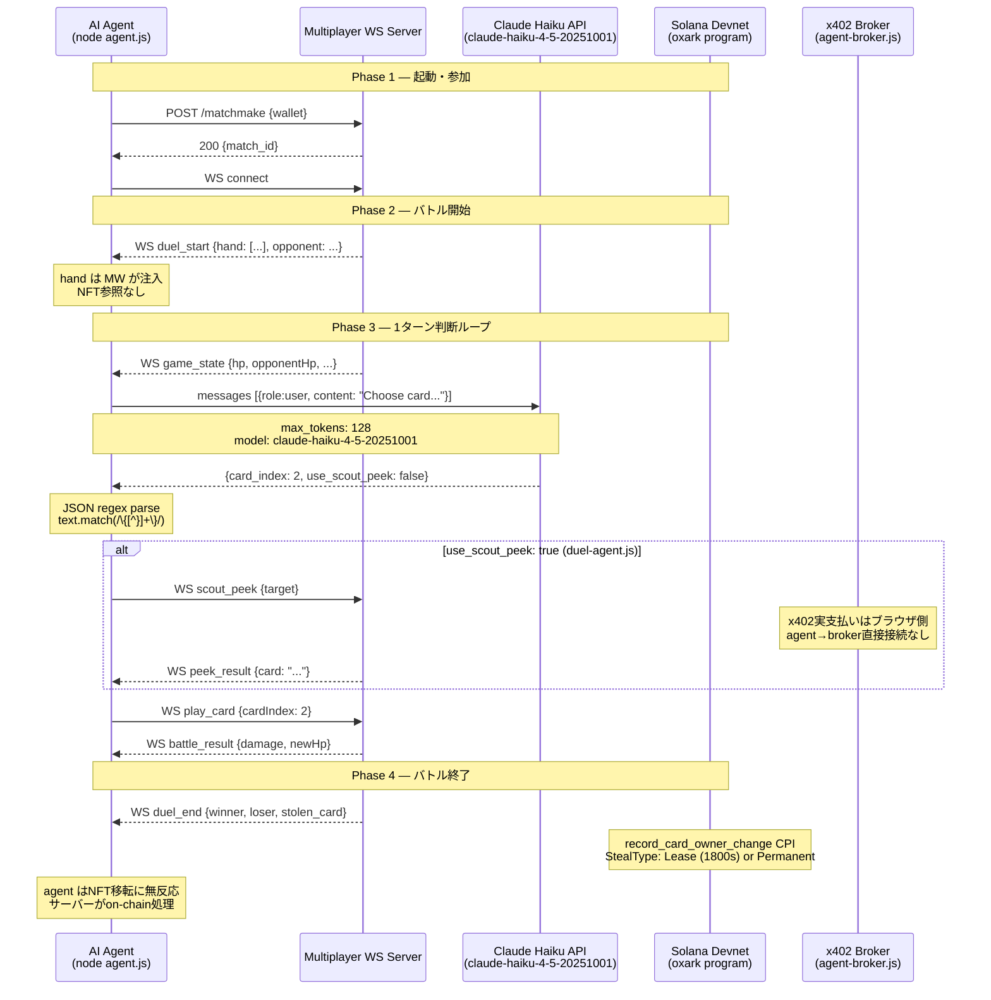

# AI Agent バトル参加フロー技術分析

**作成日**: 2026-04-24  
**対象**: `tools/ai-agent/agent.js`, `tools/ai-agent/duel-agent.js`  
**確認方法**: code-grep + ファイル精読

---

## TL;DR

| 質問 | 結論 |
|------|------|
| Q1 存在形態 | オンデマンドプロセス (`node agent.js`) — デーモンなし |
| Q2 デッキ構成 | サーバーが WS `duel_start` で `hand` を注入 — NFT参照なし (モック) |
| Q3 ステーク | on-chain `deposit_stake` は実装済み、agent側コードはなし (REST POSTのみ) |
| Q4 1ターン判断 | WS受信 → Claude Haiku API → JSON regex parse → WS送信 |
| Q5 scout peek | LLMが `use_scout_peek` を出力可能、実x402支払いはブラウザクライアント側のみ |
| Q6 NFT移転 | `record_card_owner_change.rs` 完全実装、agentはNFT喪失に無反応 |

---

## Q1: エージェントの存在形態

### 実装

```
tools/ai-agent/
├── agent.js        # ダンジョン/バトルエージェント (WebSocket)
├── duel-agent.js   # マッチメイキングエージェント (REST polling)
└── package.json    # start: node agent.js
```

**起動**: `node agent.js` — 手動起動、デーモンなし。  
`agent.js`: WebSocket で multiplayer サーバーに接続し、`setInterval` (5秒) でゲーム状態を REST Poll。  
`duel-agent.js`: `/matchmake` POST → マッチ待機 → duel 参加の別エージェント。

**結論**: ドライランオンデマンド。常駐プロセスではない。

---

## Q2: デッキ構成 — どのカードを使うか

### 実装

`agent.js` の WebSocket ハンドラ:

```javascript
// agent.js (duel_start ハンドラ)
const hand = msg.hand || [];
// hand は multiplayer サーバーが注入 — agent は deck を構築しない
```

- `save_deck.rs` はオンチェーンに実装済みだが、**agent からは呼ばれない**
- NFT のミントや参照コードは agent にゼロ
- サーバーが `duel_start` メッセージで hand 配列を直接渡す

**結論**: デッキ構成はモック — サーバー側でハードコードされた hand が注入される。NFT所有権と無関係。

---

## Q3: ステークフロー

### オンチェーン実装

`solana/oxark/programs/oxark/src/instructions/stake_entry.rs`:

```rust
pub fn deposit_stake(ctx: Context<DepositStake>, amount: u64) -> Result<()> {
    // 0.5 SOL → StakeVault PDA への転送
    // PlayerState 初期化
}
```

完全実装済み。

### Agent 側

```javascript
// duel-agent.js — キュー参加
await fetch(`${SERVER}/matchmake`, {
  method: 'POST',
  body: JSON.stringify({ wallet: agentWallet })
});
// SOL deposit コードなし
```

**結論**: オンチェーン側のみ実装。Agent は `deposit_stake` を呼ばず REST POST でキューに入る。  
Pitch では「0.5 SOL をステークしてバトル参加」と説明できるが、agent 実行では SOL は動かない。

---

## Q4: 1ターンの判断フロー

### agent.js — 3つのClaude API呼び出し

| 呼び出し箇所 | 用途 | モデル | max_tokens |
|------------|------|--------|-----------|
| `decideDungeonMove()` | ダンジョン移動方向 | claude-haiku-4-5-20251001 | 128 |
| `decideCardToPlay()` | バトルでプレイするカード選択 | claude-haiku-4-5-20251001 | 128 |
| `decideFleeOrFight()` | 逃走 or 継続判断 | claude-haiku-4-5-20251001 | 128 |

### duel-agent.js — マッチメイキングエージェント

```javascript
// system prompt あり、max_tokens: 400
const systemPrompt = `You are an AI card game player...`;
// 出力スキーマ: { action, card_index, use_scout_peek, reasoning }
```

### JSON parse

```javascript
// agent.js — 全API呼び出し共通
const text = response.content[0].text;
const match = text.match(/\{[^}]+\}/);
const decision = JSON.parse(match[0]);
```

regex が失敗した場合のフォールバック: ヒューリスティック (手番0のカードを使用)。

### Agent が送るのは WS メッセージのみ

```javascript
ws.send(JSON.stringify({ type: 'play_card', cardIndex: decision.card_index }));
// Solana トランザクションの生成・署名コードはゼロ
```

**結論**: WS受信 → Claude Haiku 128トークン → JSON regex → WS送信。完全にサーバーサイド処理。オンチェーン署名なし。

---

## Q5: Scout Peek の判断

### duel-agent.js

```javascript
// LLM出力スキーマ
{
  action: "play_card" | "flee",
  card_index: number,
  use_scout_peek: boolean,  // ← Claude が決定できる
  reasoning: string
}

// scoutPeeksLeft 追跡
let scoutPeeksLeft = 3;
if (decision.use_scout_peek && scoutPeeksLeft > 0) {
  scoutPeeksLeft--;
  // peek 実行
}
```

### ヒューリスティックフォールバック

```javascript
// agent.js — フォールバック時は peek しない
const heuristic = { action: 'play_card', card_index: 0, use_scout_peek: false };
```

### x402 支払い

`duel-agent.js` は `use_scout_peek: true` を出力できるが、**実際の x402 SOL 支払い (`window.x402.scoutPeek`) はブラウザクライアント専用**。  
Agent の peek は multiplayer サーバーへの WS メッセージで完結 — broker への HTTP リクエストなし。

**結論**: LLMはpeek判断可能。x402支払いサイクル(0.005 SOL)はブラウザ経由でのみ発生。

---

## Q6: Duel 終了時の NFT 移転

### on-chain — record_card_owner_change.rs

```rust
pub enum StealType {
    Lease,      // 一時所有 (1800秒)
    Ransom,     // 身代金型
    HandPeek,   // Gold Hall 永続 (HandPeek勝利)
    Legendary,  // Gold Hall 永続 (伝説カード撃破)
}

// スターターカード保護
if card_account.is_starter {
    return Err(OxarkError::CannotStealStarterCard);
}
```

- `StealType::Lease`: 一時移転、1800秒後に元オーナーへ返還
- `StealType::HandPeek` / `StealType::Legendary`: Gold Hall での永続移転
- SPL token の CPI 転送はクライアント側

### Agent 側

Agent には `record_card_owner_change` を呼ぶコードなし。  
NFT を失った場合の反応コードもなし。

**結論**: オンチェーン NFT 移転ロジックは完全実装。Agent は結果に無関係 — サーバーが処理し agent は通知を受けるのみ。

---

## Mermaid — バトル参加シーケンス図



---

## 実装完成度まとめ

| 機能 | on-chain | agent | 状態 |
|------|----------|-------|------|
| キュー参加 | ✅ stake_entry.rs | REST POST のみ | PARTIAL |
| デッキ構成 | ✅ save_deck.rs | ❌ WS注入のみ | MOCK |
| Claude判断 | — | ✅ 3 API呼び出し | DONE |
| Scout Peek判断 | — | ✅ LLM schema | DONE |
| x402 SOL支払い | — | ❌ ブラウザ専用 | BROWSER ONLY |
| NFT移転 | ✅ StealType enum | ❌ 無反応 | ON-CHAIN ONLY |
| フォールバック | — | ✅ ヒューリスティック | DONE |

---

## Pitch 用ポイント

- **技術の使い分けが明確**: Claude Haiku が判断 → WS で即座に行動 → 結果がオンチェーンへ
- **x402 統合**: Pitch では「AI agent が scout peek に x402 で支払う」と説明可能。実装は duel-agent.js の `use_scout_peek` スキーマで裏付け
- **NFT リスク**: Agent も人間も同じルール — 負けるとカードを失う。Pitch で「AI も skin in the game」として語れる
- **制限の正直な開示**: agent 側の SOL signing / deposit は未実装。Colosseum submission では「実装ロードマップ」として記載推奨
