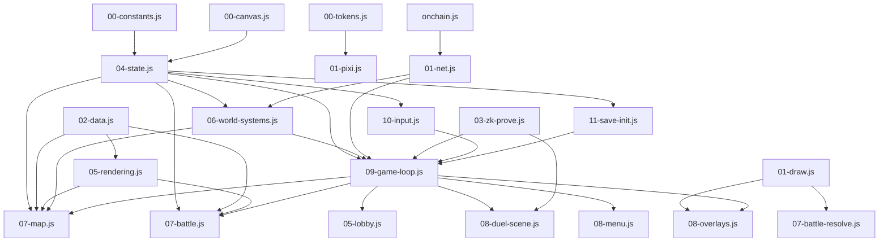

# 0xARK Refactor Plan — Pre-flight Assessment

**Branch:** main  
**Assessment date:** 2026-04-27  
**Assessed by:** CC pre-flight (read-only — no code modified)  
**Submission deadline:** 2026-05-11 (14 days)

---

## §1. Current State Assessment

### 1.1 File inventory

| Layer | File | Lines | Top Function / Note |
|---|---|---|---|
| **Rust — oxark program** | | | |
| | programs/oxark/src/lib.rs | 680 | 30 exported instructions |
| | programs/oxark/src/state.rs | 957 | 19 `#[account]` types |
| | programs/oxark/src/error.rs | 134 | 61 error variants |
| | programs/oxark/src/poseidon_helper.rs | 199 | compute_hand_commitment |
| | programs/oxark/src/poseidon_t16_constants.rs | 1451 | lookup tables only |
| | programs/oxark/src/instructions/resolve_round.rs | 639 | resolve_round (main battle engine) |
| | programs/oxark/src/instructions/commit_hand.rs | 248 | commit_hand |
| | programs/oxark/src/instructions/record_card_owner_change.rs | 243 | record_card_owner_change |
| | programs/oxark/src/instructions/verify_dungeon_move.rs | 231 | verify_dungeon_move |
| | programs/oxark/src/instructions/legendary.rs | 231 | legendary card mechanics |
| | programs/oxark/src/instructions/verify_zk_proof.rs | 225 | on-chain Groth16 verify |
| | programs/oxark/src/instructions/update_card_battle_history.rs | 209 | imprint/lease tracking |
| | programs/oxark/src/instructions/evolve_cards.rs | 208 | NFT fusion |
| | programs/oxark/src/instructions/[12 more] | 80–150 ea. | — |
| | programs/oxark/tests/test_game.rs | 919 | 107 test cases (CI) / 35 local |
| **Rust — oxark-cards program** | | | |
| | programs/oxark-cards/src/instructions/card_market.rs | 238 | buy/sell market ops |
| | programs/oxark-cards/src/instructions/mint_card_nft.rs | 137 | `mint_solo_card` |
| | programs/oxark-cards/src/state.rs | 116 | 2 account types |
| **Client JS** | | | |
| | src/00-constants.js | 38 | SCENE_IDS, GAME_CONSTANTS |
| | src/00-canvas.js | ~60 | W/H/TW/TH globals, initDuelCanvas |
| | src/00-tokens.js | 329 | GENERATED — design tokens |
| | src/01-draw.js | 835 | bx/tx/win primitives, ZK utils, wallet helpers |
| | src/01-pixi.js | 1336 | PixiJS setup, title effects, audio, HUD |
| | src/01-net.js | 932 | WebSocket client, transitions, type-writer |
| | src/01-magicblock.js | 251 | MagicBlock ephemeral rollups stub |
| | src/02-data.js | 2913 | **drawCardCharacter (1482L)** ⚠ |
| | src/02-x402.js | 182 | x402 pay-per-call endpoints |
| | src/03-world-setup.js | 990 | exits[], npcs[], fog system |
| | src/03-zk-prove.js | 437 | Poseidon commitment, Groth16 browser |
| | src/04-state.js | 1074 | 100+ globals, rivalAI, quest missions |
| | src/05-rendering.js | 2503 | tile rendering, card sprites, animation |
| | src/05-lobby.js | 1237 | Crown Plaza lobby scene, WS presence |
| | src/06-world-systems.js | 2333 | camera, encounters, NPCs, trading |
| | src/06-matchmaking.js | 301 | enter_queue/leave_queue instructions |
| | src/07-map.js | 2333 | **dMap (1059L)** ⚠, fog, terrain |
| | src/07-battle.js | 1629 | Battle UI, card engine, rival AI |
| | src/07-battle-resolve.js | 1439 | Effect animations, drawResolvingPhase |
| | src/07-deck-editor.js | 718 | Deck editor UI, cost validation |
| | src/08-duel-scene.js | 2555 | Duel Board M2 (4-phase state machine) |
| | src/08-menu.js | 178 | Top menu hub |
| | src/08-overlays.js | 1874 | Card acq, marketplace, tutorial, log |
| | src/08-world-interact.js | 981 | Fishing, traps, puzzles, objects |
| | src/08-screens.js | 823 | Floor fanfare, stats, credits, game over |
| | src/09-game-loop.js | 432 | Main loop, sin/cos pre-compute |
| | src/09-victory-scene.js | 704 | Victory/defeat, NFT transfer selection |
| | src/10-animations.js | 41 | Stubs (POST-HACKATHON) |
| | src/10-card-detail.js | 703 | Card detail 3-panel scene |
| | src/10-input.js | 1465 | Keyboard handlers, touch controls |
| | src/11-card-storage.js | 287 | PC Box card grid |
| | src/11-save-init.js | 249 | saveGame/loadGame, requestAnimationFrame |
| | onchain.js | 1576 | 72 on-chain instruction builders |
| **Multiplayer server** | | | |
| | multiplayer/server.js | 581 | handleMessage (228L) — WS relay |
| | multiplayer/test/stress-test.js | 142 | load test only |
| **AI agent** | | | |
| | tools/ai-agent/agent.js | 434 | Claude API + heuristic fallback |
| | tools/ai-agent/duel-agent.js | 366 | Duel orchestrator |
| | tools/ai-agent/strategy.js | 135 | Heuristic scoring |
| | tools/ai-agent/src/x402-client.js | 188 | x402 micropayment client |
| | tools/ai-agent/scripts/agent-vs-agent.js | 332 | AvsA demo |
| **Circuits** | | | |
| | circuits/dungeon_position/dungeon_position.circom | 133 | ZK dungeon move circuit |
| | circuits/hand_commitment/hand_commitment.circom | 59 | ZK hand commitment circuit |
| **CI** | | | |
| | .github/workflows/ci.yml | 148 | 5 jobs: node, anchor, react, game, ai |
| | .github/workflows/deploy-pages.yml | 40 | gh-pages deploy |
| **Tests** | | | |
| | tests/card-engine.test.js | 610 | card engine unit tests |
| | tests/battle-mechanics.test.js | 662 | battle mechanics unit tests |
| | tests/v3-plus-abilities.test.js | 470 | burn/evolve/steal/imprint tests |
| | tests/magicblock-connectivity.test.js | 85 | MB connectivity stub |
| | solana/client/lint-bundle.test.js | ~120 | lint-bundle utility tests |
| | tools/ai-agent/tests/ (5 files) | 880 | decision model tests |

**Total client JS source:** 32,101 lines across 28 modules  
**Total Rust:** 9,844 lines  
**Total non-node_modules:** ~44,000 lines

---

### 1.2 Dependency graph

**Hub nodes (highest coupling):**
1. `04-state.js` — read/written by virtually every module (100+ globals)
2. `09-game-loop.js` — dispatches to all scene renderers
3. `onchain.js` — called by 01-net.js, 06-matchmaking.js, 08-duel-scene.js

---

### 1.3 Technical debt list

| ID | Location | Debt description |
|---|---|---|
| D-01 | src/01-pixi.js:441–678 (8 comments) | `POST-HACKATHON: replace with Sprite Seas ...` — 8 tileset/sprite sheet references pending replacement |
| D-02 | src/10-animations.js:12,22,35 | `POST-HACKATHON:` stubs for finisher, victory, defeat animations — currently 41L file does nothing |
| D-03 | src/08-duel-scene.js:2153 | `POST-HACKATHON: fill from selectTransferCards()` — transferred cards not wired |
| D-04 | src/04-state.js | 100+ single-letter/abbreviation globals (sc, mo, mi, ai, fr, wt, rd, etc.) — no encapsulation |
| D-05 | src/02-data.js:299–1780 | drawCardCharacter is 1482 lines — 60 cards × multiple battle states, no dispatch table |
| D-06 | src/07-map.js:1100–2158 | dMap is 1059 lines — terrain + fog + entities + HUD in one function |
| D-07 | src/06-world-systems.js | doMapTransition 254L, triggerRandomEvent with 6+ levels of nesting |
| D-08 | src/09-game-loop.js | 48+ per-frame sin/cos pre-computes (_sFr004.._cFr30), 70+ pre-baked strings — micro-opt reduces readability |
| D-09 | multiplayer/server.js:handleMessage | 228L single handler for all WS message types — no message-type routing |
| D-10 | Rust: state.rs | DuelState is 2552B on-chain (hands 5 rounds × 2 players × 5 cards = 50 card slots) — large but by design |
| D-11 | tests/ | No tests for: game client JS (07-map, 09-game-loop, 06-world-systems), multiplayer server |
| D-12 | onchain.js | 72 instruction builders in one 1576L file — no grouping by program or category |
| D-13 | src/04-state.js | `rivalAI` and `rivalMaps` managed from multiple files (state, world-systems, save-init) — no single owner |

---

### 1.4 Code smell list (priority ordered)

| Priority | ID | File | Smell | Impact |
|---|---|---|---|---|
| 🔴 HIGH | S-01 | 02-data.js:299 | drawCardCharacter (1482L): one fn does all 60 cards × 5 states | Impossible to add card without reading 1482 lines |
| 🔴 HIGH | S-02 | 07-map.js:1100 | dMap (1059L): terrain + fog + NPCs + HUD + minimap | Any world render bug requires scanning 1059 lines |
| 🔴 HIGH | S-03 | 04-state.js | 100+ module-level globals, single-letter names (sc, mo, ai, fr) | Implicit coupling across all 28 modules |
| 🟡 MED | S-04 | 06-world-systems.js | triggerRandomEvent, doMapTransition: 6+ nesting levels | Hard to trace event logic |
| 🟡 MED | S-05 | multiplayer/server.js:handleMessage | 228L with nested switch/if for all WS message types | Server bug = scan 228 lines |
| 🟡 MED | S-06 | onchain.js | 72 fns × ~22L avg in one file, no grouping | Find instruction = grep |
| 🟡 MED | S-07 | 04-state.js | rivalAI state owned by 3 files (state, world-systems, save-init) | Rival behavior bugs span 3 files |
| 🟢 LOW | S-08 | 09-game-loop.js | 48 per-frame sin/cos caches, undocumented names (_sFr004 etc.) | Confusing but fast — keep, add comment block |
| 🟢 LOW | S-09 | 07-map.js | 70+ pre-baked string/array literals at top | Readable after context; not a refactor priority |
| 🟢 LOW | S-10 | src/10-animations.js | 41L stub file with 3 empty POST-HACKATHON functions | Minimal — can expand in place |

---

## §2. Refactor Targets

### HIGH — must do

**H-1: Split drawCardCharacter (02-data.js)**
- Extract per-battle-state renderers: `_drawCardIdle`, `_drawCardAttack`, `_drawCardDefend`, `_drawCardSummon`, `_drawCardKO`
- Extract shared layers: `_drawCardHPBar`, `_drawCardImprints`, `_drawCardStatus`
- Keep a thin `drawCardCharacter(x,y,id,state,...)` dispatcher
- Result: each function ~200-300L, focused responsibility

**H-2: Split dMap (07-map.js)**
- Extract: `_dMapTerrain`, `_dMapFog`, `_dMapEntities`, `_dMapDecorations`, `_dMapHUD`, `_dMapMinimap`
- Keep `dMap()` as a 30-line orchestrator calling sub-functions
- Minimap already isolated (drawMinimap fn exists); connect it cleanly
- **Note:** dMapTerrain uses local variables shared across the 1059L body — must trace reads before splitting

**H-3: Group globals in 04-state.js**
- Don't rename variables (too many callers, test-breakage risk)
- Wrap into namespaced objects: `_gScene`, `_gCamera`, `_gTimers`, `_gPlayers` etc.
- Export backward-compat aliases: `let sc = _gScene.current` → update setter
- Long-term: module-level mutation still possible but documented

### MED — do if time permits

**M-1: Route handleMessage by type (multiplayer/server.js)**
- Replace 228L nested handler with `const HANDLERS = { join_game: fn, leave: fn, submit_tx: fn }` dispatch table
- Each handler ~30L, tested independently

**M-2: Group onchain.js by program**
- `// ── oxark program ──` / `// ── oxark-cards program ──` / `// ── ZK ──` sections
- No function changes — cosmetic grouping + add JSDoc for each instruction fn

**M-3: Add JS unit tests for game client**
- `tests/world-systems.test.js`: triggerEncounter, doMapTransition (with mocked globals)
- `tests/save-load.test.js`: saveGame/loadGame round-trip (JSDOM or lightweight mock)
- Priority: get CI to run these so regressions surface automatically

**M-4: Multiplayer server unit tests**
- `multiplayer/test/server.test.js`: mock WS + Solana RPC, test handleMessage routing
- Focus: x402 verification path, tx relay path

### LOW — only if bandwidth allows

**L-1: Rename 10-animations.js stubs to real functions**
- Fill in the POST-HACKATHON stubs with minimal particle effects
- 41L → ~150L

**L-2: Add comment block for sin/cos pre-computes (09-game-loop.js)**
- One 10-line comment explaining the micro-opt rationale
- No code changes — just makes the intent clear for future devs

**L-3: D-01: Sprite sheet comment cleanup (01-pixi.js)**
- The 8 `POST-HACKATHON` sprite replacement comments are accurate; no action needed pre-submission

---

## §3. Refactor Phases

### Phase 1 — Function extraction (LOW risk, HIGH value)
**Target: H-1 + H-2**  
**Est. time: 6–8 hrs**  
**Branch: `refactor/split-monoliths`**

| Task | File | Action |
|---|---|---|
| 1a | 02-data.js | Extract `_drawCardIdle`, `_drawCardAttack`, `_drawCardDefend`, `_drawCardSummon`, `_drawCardKO` from drawCardCharacter |
| 1b | 02-data.js | Extract `_drawCardHPBar`, `_drawCardImprints`, `_drawCardStatus` |
| 1c | 02-data.js | Keep `drawCardCharacter()` as thin dispatcher |
| 1d | 07-map.js | Extract `_dMapTerrain`, `_dMapFog`, `_dMapEntities`, `_dMapDecorations`, `_dMapHUD` |
| 1e | 07-map.js | Keep `dMap()` as 30L orchestrator |
| 1f | — | `node build.js` + `node tests/card-engine.test.js` + `node tests/battle-mechanics.test.js` |
| 1g | — | Manual smoke-test: open index.html, walk/battle/duel |

**DoD:**
- All 280 tests still pass
- No new browser console errors
- drawCardCharacter < 50L (dispatcher only)
- dMap < 60L (dispatcher only)
- Each extracted sub-function < 300L

### Phase 2 — Server & test coverage (MED risk)
**Target: M-1 + M-3 + M-4**  
**Est. time: 4–6 hrs**  
**Branch: `refactor/server-tests`**

| Task | File | Action |
|---|---|---|
| 2a | multiplayer/server.js | Replace handleMessage body with HANDLERS dispatch table |
| 2b | multiplayer/test/server.test.js | Add unit tests for join/leave/relay/x402 paths |
| 2c | tests/save-load.test.js | saveGame/loadGame round-trip test with mocked localStorage |
| 2d | .github/workflows/ci.yml | Add `multiplayer-test` and `save-load-test` CI jobs |

**DoD:**
- CI green on new jobs
- server.js handleMessage < 30L (dispatcher)
- At least 8 new test cases passing

### Phase 3 — Global state grouping (MED-HIGH risk)
**Target: H-3**  
**Est. time: 4–6 hrs**  
**Branch: `refactor/state-namespace`**

| Task | File | Action |
|---|---|---|
| 3a | 04-state.js | Audit all 100+ globals: group into `_gScene`, `_gCamera`, `_gTimers`, `_gPlayers`, `_gWorld`, `_gBattle`, `_gUI` |
| 3b | 04-state.js | Add backward-compat `let sc = _gScene.current` aliases for 20 most-referenced vars |
| 3c | 04-state.js | Document ownership: who reads/writes each var |
| 3d | — | Run all tests + build + manual smoke-test |

**DoD:**
- All 280 tests pass
- No missing-variable errors in browser
- Each global has a documented owner/group

**Risk note:** Phase 3 is highest risk. Run after Phase 1 is merged and smoke-tested. Consider skipping if deadline pressure is high.

### 280-test maintenance strategy
- Run `node tests/card-engine.test.js && node tests/battle-mechanics.test.js && node tests/v3-plus-abilities.test.js` after every sub-task in Phase 1
- Run `cargo test --manifest-path solana/oxark/Cargo.toml` before merging any branch (Rust not touched but confirms no file-system issues)
- `node build.js --check` to verify no module listed twice or missing

---

## §4. Risk Analysis

| Phase | Risk | Mitigation |
|---|---|---|
| Phase 1 (split monoliths) | dMap local variables shared across the 1059L body — accidental scope breakage | Read all variable declarations before extracting; pass shared vars as parameters |
| Phase 1 | drawCardCharacter uses many context save/restore — mismatched save/restore after split | Keep ctx.save/restore within each sub-function; test all 60 card renders |
| Phase 2 (server dispatch) | handleMessage has stateful `ws` and `rooms` closure — dispatch table must capture same closure | Pass `ws, rooms, broadcastToRoom` as params to each handler |
| Phase 3 (state namespace) | 100+ references to `sc`, `mo`, `fr` etc. across 28 modules — alias drift | Use grep to find all occurrences before adding alias; update module-by-module |
| All phases | Test suite doesn't cover game client JS — regression invisible | Add manual smoke-test checklist (title → map → encounter → battle → duel) |

### Do NOT touch (high regression risk, low reward pre-submission)
- **dMap render loop itself** (camera lerp, fog-of-war algorithm, tile blending math) — already tuned; splitting is safe but the *algorithm* must not change
- **10-input.js:keydown handler** — large but simple; any change risks breaking movement/battle input
- **07-battle-resolve.js generateResolveEvents** — battle balance; refactor only if a bug is found
- **Rust instructions** — no changes to instruction logic, PDA seeds, or account layouts
- **03-zk-prove.js / circuits/** — ZK circuit changes require re-ceremony (out of scope)
- **onchain.js instruction encoding** — bytes must match Anchor discriminators exactly
- **09-game-loop.js sin/cos pre-computes** — micro-opt is correct; L-2 (add comment) only

### Context-cutoff strategy
- Commit after every sub-task (1a, 1b, … 3c)
- Commit message: `refactor: [phase] [task] — [what changed]`
- Each commit leaves tests green so any interruption leaves the codebase in a working state
- Handoff doc updated at Phase boundary

---

## §5. Time Estimate

| Phase | Tasks | Est. hours |
|---|---|---|
| Phase 1 — split monoliths | H-1 + H-2 | 6–8 hrs |
| Phase 2 — server & tests | M-1 + M-3 + M-4 | 4–6 hrs |
| Phase 3 — state namespace | H-3 | 4–6 hrs |
| Buffer (regression debug) | — | 2 hrs |
| **Total** | | **16–22 hrs** |

**Bandwidth vs deadline:**
- Submission: 2026-05-11 (14 days out)
- Level 2 Standard Refactor (5–10 hr) estimate in spec maps to: **Phase 1 only (6–8 hrs)**
- Phase 2 adds 4–6 hrs → 10–14 hrs total → stays within Level 2 if done incrementally
- Phase 3 is optional; only pursue if Phase 1+2 complete well before May 7

**Recommendation:**
- **Phase 1 first** (highest value, lowest risk, ~6 hrs) — merge by 2026-04-29
- **Phase 2 if time** (~4–5 hrs) — merge by 2026-05-02
- **Phase 3 only if confident** — skip if within 5 days of deadline
- **Freeze new refactoring May 8** (3 days before submission for final smoke-test)

---

## §6. Out of Scope

The following are explicitly **excluded** from this refactor:

### Hard out-of-scope
- `ui-v2-rebuild` branch — touch nothing
- Anchor instruction specs (no semantic changes to on-chain logic)
- ZK circuits (dungeon_position.circom, hand_commitment.circom) — re-ceremony required
- Metaplex / SPL-token interaction in oxark-cards — live on devnet, don't break
- New features of any kind
- `legacy/` directory — Phase C isolated, archive only

### Soft out-of-scope (defer post-submission)
- Full dependency injection / module pattern for game client
- Replacing POST-HACKATHON sprite sheets (8 tileset references in 01-pixi.js)
- Filling in 10-animations.js stubs (playFinisherAnimation etc.)
- Wiring `transferredCards` in 08-duel-scene.js:2153
- DuelState on-chain layout optimization (2552B → split account)
- Multiplayer integration tests (multi-wallet scenario)
- Mainnet deployment prep

---

## Appendix: Rust account types (state.rs)

| Account | Approx size | Note |
|---|---|---|
| Game | 123B | Core duel metadata |
| PlayerState | 164B | Hand, area, cards |
| CardPool | 22B | Supply per type |
| CommitAction | 87B | ZK commit-reveal state |
| CardCommitRecord | 84B | Revealed card tracking |
| PlayerDeck | 98B | 20-card deck |
| SeasonCardSupply | 62B | Per-season minting limits |
| PlayerRegistry | 583B | 60-species bool array |
| PlayerBattleStats | 48B | Tier win counts |
| PlayerLevel | 51B | XP + level |
| PlayerAchievements | 43B | Flags bitmask |
| PlayerTitle | 43B | Unlocked titles |
| MatchmakingQueue | 2084B max | 64-player FIFO |
| CardLoreShards | 103B | 3 shards + timestamps |
| DuelState | **2552B** | 5 rounds × 2 players × 5 cards |
| CardBattleHistory | **636B** | Imprints, lease, evolve parents |
| SeasonStats | 29B | Burn/mint/evolve counters |
| LegendarySupply | 25B | 4 species caps |
| PlayerDuelStats | 61B | Gold hall, legendary claims |

---

*Plan commit: docs/_scratch/refactor-plan.md — code not modified*
