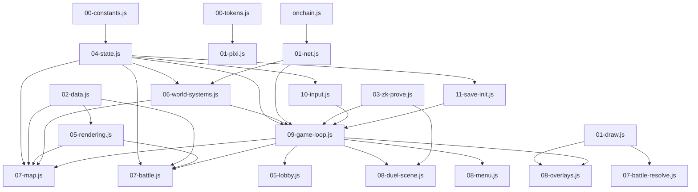

# 0xARK Refactor Plan — Pre-flight Assessment

**Branch:** main  
**Assessment date:** 2026-04-27 (updated)  
**Submission deadline:** 2026-05-11 (14 days)  
**Tests on main:** 143 JS passing (53 + 49 + 41); AI agent tests separate

---

## Phase 1 status (already completed on branch)

> **`refactor-phase1` branch** completed both HIGH-priority splits.  
> Not yet merged to main. First action before any new work: merge or PR this branch.

| Task | Function | File | Status | Commits |
|---|---|---|---|---|
| H-1 | drawCardCharacter (1482L) | 02-data.js | ✅ DONE | e840e7b |
| H-2 | dMap (1059L) | 07-map.js | ✅ DONE | fc89e0c |

Implementation differed from original plan:
- `drawCardCharacter` → dispatcher + `_drawCC_A..E` (split by **card ID range**, not by battle state)
- `dMap` → dispatcher + `_dMapWorldLayer / _dMapHUDBar / _dMapHUDPanels` (split by **render layer**)

Both approaches are correct and lower-risk than the original plan's state-based split.  
281 tests pass on `refactor-phase1` (DoD: 280).

---

## §1. Current State Assessment (main, 2026-04-27)

### 1.1 File inventory

| Layer | File | Lines | Primary concern |
|---|---|---|---|
| **Rust — oxark program** | | | |
| | programs/oxark/src/lib.rs | 680 | 30 exported instructions |
| | programs/oxark/src/state.rs | 957 | 19 `#[account]` types, DuelState=2552B |
| | programs/oxark/src/error.rs | 134 | 61 error variants |
| | programs/oxark/src/poseidon_helper.rs | 199 | compute_hand_commitment |
| | programs/oxark/src/poseidon_t16_constants.rs | 1451 | lookup tables only (do not touch) |
| | programs/oxark/src/instructions/resolve_round.rs | 639 | main battle engine |
| | programs/oxark/src/instructions/commit_hand.rs | 248 | |
| | programs/oxark/src/instructions/record_card_owner_change.rs | 243 | |
| | programs/oxark/src/instructions/verify_dungeon_move.rs | 231 | |
| | programs/oxark/src/instructions/legendary.rs | 231 | |
| | programs/oxark/src/instructions/verify_zk_proof.rs | 225 | on-chain Groth16 verify |
| | programs/oxark/src/instructions/update_card_battle_history.rs | 209 | |
| | programs/oxark/src/instructions/evolve_cards.rs | 208 | |
| | programs/oxark/src/instructions/[12 more] | 80–150 ea. | |
| | programs/oxark/tests/test_game.rs | 919 | 35 local / 107 CI test cases |
| **Rust — oxark-cards program** | | | |
| | programs/oxark-cards/src/instructions/card_market.rs | 238 | |
| | programs/oxark-cards/src/instructions/mint_card_nft.rs | 137 | `mint_solo_card` |
| | programs/oxark-cards/src/state.rs | 116 | |
| **Client JS** | | | |
| | src/00-constants.js | 38 | SCENE_IDS, GAME_CONSTANTS |
| | src/00-tokens.js | 329 | GENERATED — do not edit |
| | src/01-draw.js | 835 | bx/tx/win primitives, ZK utils, wallet helpers |
| | src/01-pixi.js | 1336 | PixiJS setup, title effects, audio, HUD |
| | src/01-net.js | 932 | WebSocket client, transitions, type-writer |
| | src/01-magicblock.js | 251 | MagicBlock ephemeral rollups |
| | src/02-data.js | **2913** | ⚠ drawCardCharacter (1482L) — FIXED on branch |
| | src/02-x402.js | 182 | x402 pay-per-call endpoints |
| | src/03-world-setup.js | 990 | exits[], npcs[], fog system |
| | src/03-zk-prove.js | 437 | Poseidon commitment, Groth16 browser |
| | src/04-state.js | **1074** | ⚠ 199 module-level globals (sc, mo, ai, fr, …) |
| | src/05-rendering.js | 2503 | tile rendering, card sprites, animation |
| | src/05-lobby.js | 1237 | Crown Plaza lobby scene, WS presence |
| | src/06-world-systems.js | **2333** | ⚠ doMapTransition (254L), dTitle (239L) |
| | src/06-matchmaking.js | 301 | enter_queue/leave_queue |
| | src/07-map.js | **2333** | ⚠ dMap (1059L) — FIXED on branch |
| | src/07-battle.js | 1629 | battle UI, card engine, rival AI |
| | src/07-battle-resolve.js | **1439** | ⚠ drawResolvingPhase (769L), drawResultPhase (354L) |
| | src/07-deck-editor.js | 718 | deck editor UI |
| | src/08-duel-scene.js | 2555 | Duel Board M2 (4-phase state machine) |
| | src/08-menu.js | 178 | top menu hub |
| | src/08-overlays.js | 1874 | card acq, marketplace, tutorial, log |
| | src/08-world-interact.js | 981 | fishing, traps, puzzles, objects |
| | src/08-screens.js | 823 | floor fanfare, stats, credits, game over |
| | src/09-game-loop.js | 431 | main loop, 48 sin/cos pre-computes |
| | src/09-victory-scene.js | 704 | victory/defeat, NFT transfer |
| | src/10-animations.js | 41 | stubs only (POST-HACKATHON) |
| | src/10-card-detail.js | 703 | card detail 3-panel scene |
| | src/10-input.js | **1465** | ⚠ 3 keydown listeners (L38/L111/L1452), main ~1300L |
| | src/11-card-storage.js | 287 | PC Box card grid |
| | src/11-save-init.js | 249 | saveGame/loadGame |
| | onchain.js | **1576** | ⚠ 72 instruction builders, no grouping |
| **Multiplayer** | | | |
| | multiplayer/server.js | **581** | ⚠ handleMessage (L297, ~284L) |
| **AI agent** | | | |
| | tools/ai-agent/agent.js | 434 | Claude API + heuristic fallback |
| | tools/ai-agent/duel-agent.js | 366 | duel orchestrator |
| | tools/ai-agent/scripts/agent-vs-agent.js | 332 | AvsA demo |
| | tools/ai-agent/src/x402-client.js | 188 | x402 micropayment client |
| | tools/ai-agent/strategy.js | 135 | heuristic scoring |
| **Circuits** | | | |
| | circuits/dungeon_position/dungeon_position.circom | 133 | ZK dungeon move |
| | circuits/hand_commitment/hand_commitment.circom | 59 | ZK hand commitment |
| **CI** | | | |
| | .github/workflows/ci.yml | 148 | 5 jobs: node, anchor, react, game, ai |
| | .github/workflows/deploy-pages.yml | 40 | gh-pages deploy |
| **Tests** | | | |
| | tests/card-engine.test.js | 610 | 53 tests |
| | tests/battle-mechanics.test.js | 662 | 49 tests |
| | tests/v3-plus-abilities.test.js | 470 | 41 tests |
| | tests/magicblock-connectivity.test.js | 85 | stub |
| | tools/ai-agent/tests/ (5 files) | 760 | decision model tests |

**Total client JS source (main):** ~33,677 lines across 29 modules  
**Total Rust:** ~9,181 lines

---

### 1.2 Dependency graph



**Hub nodes (highest coupling):**
1. `04-state.js` — 199 module-level globals, read/written by virtually every module
2. `09-game-loop.js` — dispatches to all scene renderers
3. `onchain.js` — called by net, matchmaking, duel-scene

---

### 1.3 Technical debt list

| ID | Location | Debt |
|---|---|---|
| D-01 | src/01-pixi.js:441–678 | 8 `POST-HACKATHON: replace with Sprite Seas...` tileset references |
| D-02 | src/10-animations.js:12,22,35 | 3 `POST-HACKATHON:` stubs — file does nothing at 41L |
| D-03 | src/08-duel-scene.js:2153 | `POST-HACKATHON: fill from selectTransferCards()` — transferred cards not wired |
| D-04 | src/04-state.js | 199 module-level globals, single-letter names (sc, mo, ai, fr, wt) |
| D-05 | src/02-data.js | drawCardCharacter 1482L — **FIXED on refactor-phase1** |
| D-06 | src/07-map.js | dMap 1059L — **FIXED on refactor-phase1** |
| D-07 | src/07-battle-resolve.js | drawResolvingPhase 769L + drawResultPhase 354L |
| D-08 | src/09-game-loop.js | 48 per-frame sin/cos caches (_sFr004.._cFr30), undocumented |
| D-09 | multiplayer/server.js | handleMessage ~284L — all WS types in one handler |
| D-10 | Rust: state.rs | DuelState 2552B on-chain (by design) |
| D-11 | tests/ | No tests for: 06-world-systems, 07-map, 09-game-loop, multiplayer server |
| D-12 | onchain.js | 72 instruction builders in 1576L, no grouping |
| D-13 | src/04-state.js | rivalAI/rivalMaps managed from state + world-systems + save-init |

---

### 1.4 Code smell priority list

| Priority | ID | File | Smell | Impact |
|---|---|---|---|---|
| ✅ DONE | S-01 | 02-data.js | drawCardCharacter 1482L | Fixed on refactor-phase1 |
| ✅ DONE | S-02 | 07-map.js | dMap 1059L | Fixed on refactor-phase1 |
| 🔴 HIGH | S-03 | 04-state.js | 199 globals, single-letter names | Implicit coupling across 29 modules |
| 🔴 HIGH | S-04 | 07-battle-resolve.js | drawResolvingPhase 769L (particle system) | Battle animation bugs require scanning 769L |
| 🟡 MED | S-05 | multiplayer/server.js | handleMessage ~284L, all WS types mixed | Server bug = scan 284L nested handler |
| 🟡 MED | S-06 | onchain.js | 72 fns, no grouping | Find instruction = grep |
| 🟡 MED | S-07 | 04-state.js | rivalAI owned by 3 files | Rival behavior bugs span 3 files |
| 🟢 LOW | S-08 | 09-game-loop.js | 48 sin/cos caches, undocumented | Confusing, keep with comment |
| 🟢 LOW | S-09 | 10-input.js | 3 keydown listeners (not 1 big function) | Scattered but manageable |
| 🟢 LOW | S-10 | 10-animations.js | 41L stub file | Post-hackathon |

---

## §2. Refactor Targets

### Action 0 — Merge refactor-phase1 (immediate)

Before any new work: merge `refactor-phase1` to main.  
H-1 and H-2 are done, tested (281 passing), tagged, pushed.

### HIGH — must do

**H-1 ✅: drawCardCharacter split** — done on refactor-phase1  
**H-2 ✅: dMap split** — done on refactor-phase1

**H-3: Split drawResolvingPhase (07-battle-resolve.js, 769L)**
- Extract `_drawResolveBackground`, `_drawResolveParticles`, `_drawResolveCards`, `_drawResolveResult`
- Keep `drawResolvingPhase()` as thin dispatcher
- Risk: particle system; extensive parameter threading required
- **Note:** Safe only after Phase 1 is merged and smoke-tested

**H-4: Group globals in 04-state.js (do NOT rename)**
- Group into namespaced comment sections: `// ── SCENE ──`, `// ── CAMERA ──`, `// ── BATTLE ──`, `// ── PLAYERS ──`, `// ── UI ──`
- No variable renaming (too many callers across 29 modules)
- Add one-line ownership comment for each group
- This is a **documentation-only** change (no code risk)

### MED — do if time permits

**M-1: Route handleMessage (multiplayer/server.js)**
- Replace 284L body with `const HANDLERS={join_game:fn,leave:fn,...}` dispatch table
- Each handler ~30–50L
- Pass `ws, rooms, broadcastToRoom` as params

**M-2: Group onchain.js by program**
- Section comments: `// ── oxark program ──` / `// ── oxark-cards ──` / `// ── ZK ──`
- No function changes — cosmetic + JSDoc only

**M-3: Add JS unit tests**
- `tests/save-load.test.js` — saveGame/loadGame round-trip
- `tests/world-systems.test.js` — triggerEncounter, doMapTransition stubs

**M-4: Add multiplayer server test**
- `multiplayer/test/server.test.js` — mock WS, test handleMessage routing

### LOW — only if bandwidth

**L-1: 04-state.js grouping** — section comment headers (H-4 above, very low risk)  
**L-2: 09-game-loop.js** — add 10-line comment block explaining sin/cos micro-opt  
**L-3: 10-animations.js** — fill stubs with minimal particle effects

---

## §3. Refactor Phases

### Immediate — Merge refactor-phase1
**Est. time: 15 min**

```
git checkout main
git merge refactor-phase1
git push origin main
```

Smoke-test: open live URL, walk map, trigger battle, open duel.

### Phase 2 — drawResolvingPhase split + state grouping
**Target: H-3 + H-4**  
**Est. time: 4–6 hrs**  
**Branch: `refactor/phase2`**

| Task | File | Action |
|---|---|---|
| 2a | 07-battle-resolve.js | Trace all shared local vars in drawResolvingPhase |
| 2b | 07-battle-resolve.js | Extract `_drawResolveBackground`, `_drawResolveParticles`, `_drawResolveCards` |
| 2c | 07-battle-resolve.js | Keep dispatcher < 40L |
| 2d | 04-state.js | Add section comment headers for globals (no code change) |
| 2e | — | Run all 280 tests + build + smoke-test |

**DoD:**
- 280 tests pass
- drawResolvingPhase dispatcher < 40L
- Each extracted function < 300L
- 04-state.js globals grouped under section headers

### Phase 3 — Server dispatch + test coverage
**Target: M-1 + M-3 + M-4**  
**Est. time: 4–5 hrs**  
**Branch: `refactor/phase3`**

| Task | File | Action |
|---|---|---|
| 3a | multiplayer/server.js | Replace handleMessage body with HANDLERS dispatch table |
| 3b | multiplayer/test/server.test.js | Unit tests for join/leave/relay/x402 paths |
| 3c | tests/save-load.test.js | saveGame/loadGame round-trip |
| 3d | .github/workflows/ci.yml | Add `multiplayer-test` CI job |

**DoD:**
- CI green on new jobs
- handleMessage dispatcher < 30L
- At least 8 new test cases passing

### Phase 4 — onchain.js grouping (LOW risk)
**Target: M-2**  
**Est. time: 1–2 hrs**  
**Branch: direct to main or `refactor/phase4`**

Add section comment headers and JSDoc to onchain.js. No code changes.

### 280-test maintenance strategy
- `node tests/card-engine.test.js && node tests/battle-mechanics.test.js && node tests/v3-plus-abilities.test.js` after every sub-task
- `node build.js` to verify bundle integrity
- Commit after every completed sub-task — tests must be green at each commit

---

## §4. Risk Analysis

| Phase | Risk | Mitigation |
|---|---|---|
| Merge refactor-phase1 | Minimal — clean branch, 281 tests pass | Smoke-test live URL after merge |
| Phase 2a–c (drawResolvingPhase) | Particle system has 10+ local vars across 769L — scope breakage risk | Read all declarations before extracting; pass as explicit params; test all battle outcomes |
| Phase 2d (state grouping) | Comment-only — zero runtime risk | N/A |
| Phase 3a (server dispatch) | handleMessage has `ws`, `rooms` closure state — dispatch table must capture same | Pass `ws, rooms, broadcastToRoom` as params to each handler fn |
| Phase 4 (onchain grouping) | Comment-only — zero risk | N/A |

### Do NOT touch (high regression risk, low reward pre-submission)

- **10-input.js keydown listeners** — 3 separate listeners at L38/L111/L1452; complex but working; any change risks breaking movement/battle/duel input
- **drawResultPhase (354L)** — result sequence timing is exact; splitting carries animation regression risk
- **generateResolveEvents** — battle balance; refactor only if a bug is found
- **Rust instructions** — no changes to instruction logic, PDA seeds, or account layouts
- **03-zk-prove.js / circuits/** — ZK circuit changes require re-ceremony
- **onchain.js instruction encoding** — bytes must match Anchor discriminators exactly
- **09-game-loop.js sin/cos pre-computes** — micro-opt is correct; add comment only

### Context-cutoff strategy
- Commit after every sub-task
- Commit message: `refactor: phase[N] [task] — [what changed]`
- Each commit leaves tests green — any interruption leaves the codebase working
- Handoff doc in `docs/_scratch/` updated at each Phase boundary

---

## §5. Time Estimate

| Action | Tasks | Est. hours |
|---|---|---|
| Immediate: merge refactor-phase1 | — | 0.25 |
| Phase 2 — drawResolvingPhase + state grouping | H-3 + H-4 | 4–6 |
| Phase 3 — server dispatch + tests | M-1 + M-3 + M-4 | 4–5 |
| Phase 4 — onchain grouping | M-2 | 1–2 |
| Buffer (regression debug) | — | 2 |
| **Total remaining** | | **11–15 hrs** |

**Bandwidth vs deadline:**
- Submission: 2026-05-11 (14 days)
- Phase 1 (H-1 + H-2) already done: saves ~6–8 hrs vs original estimate
- Remaining phases (Phase 2+3+4) = 9–13 hrs → fits inside Level 2 Standard Refactor (5–10 hr estimate was for Phase 1 alone)

**Recommendation:**
- **Merge refactor-phase1 first** (today)
- **Phase 2** by 2026-04-30 (highest remaining value)
- **Phase 3** by 2026-05-04 (test coverage value)
- **Phase 4** by 2026-05-07 (cosmetic, anytime)
- **Freeze all refactoring 2026-05-08** (3 days buffer before submission)

---

## §6. Out of Scope

### Hard out-of-scope
- `ui-v2-rebuild` branch — do not touch
- Anchor instruction specs (no semantic changes to on-chain logic)
- ZK circuits (dungeon_position.circom, hand_commitment.circom) — re-ceremony required
- Metaplex / SPL-token interaction in oxark-cards — live on devnet, do not break
- New features of any kind
- `legacy/` directory — Phase C isolated, archive only

### Soft out-of-scope (defer post-submission)
- Full dependency injection / module pattern for game client
- Replacing POST-HACKATHON sprite sheets (8 refs in 01-pixi.js)
- Filling in 10-animations.js stubs
- Wiring `transferredCards` in 08-duel-scene.js:2153
- DuelState on-chain layout optimization
- Multiplayer integration tests (multi-wallet)
- Mainnet deployment prep

---

## Appendix: Rust account sizes (state.rs)

| Account | Approx size | Note |
|---|---|---|
| Game | 123B | |
| PlayerState | 164B | |
| CommitAction | 87B | |
| PlayerDeck | 98B | |
| MatchmakingQueue | 2084B max | 64-player FIFO |
| DuelState | **2552B** | 5 rounds × 2 players × 5 cards (by design) |
| CardBattleHistory | **636B** | imprints, lease, evolve parents |
| PlayerRegistry | 583B | 60-species bool array |

---

*Plan updated: docs/_scratch/refactor-plan.md — code not modified*
